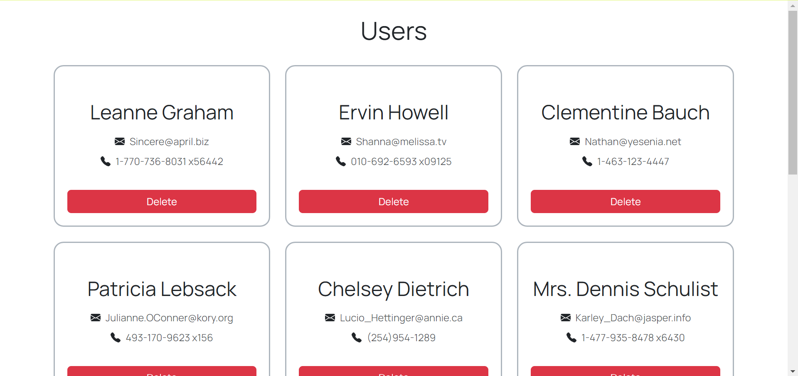

# User List

This project is a simple react/redux exercise (bootstrapped with [Create React App](https://github.com/facebook/create-react-app)) displaying a list of users fetched from the [JSONPlaceholder API](https://jsonplaceholder.typicode.com/users).

## Technologies/libraries used

- `react`
- `redux`, `@reduxjs/toolkit`
- `bootstrap` for UI
- `axios` for API fetching
- `jest`, `testing-library`, `msw` for testing

## Set up

Run `npm install` to install the necessary packages.

## Development

Run `npm start` to have the app run in development mode.\
Open [http://localhost:3000](http://localhost:3000) to view it in the browser.\
It should look something like this:

Clicking "Delete" on a user card should remove that card from the list.

## Testing

Run `npm run test` or `npm run test:watch` to run the UI tests.